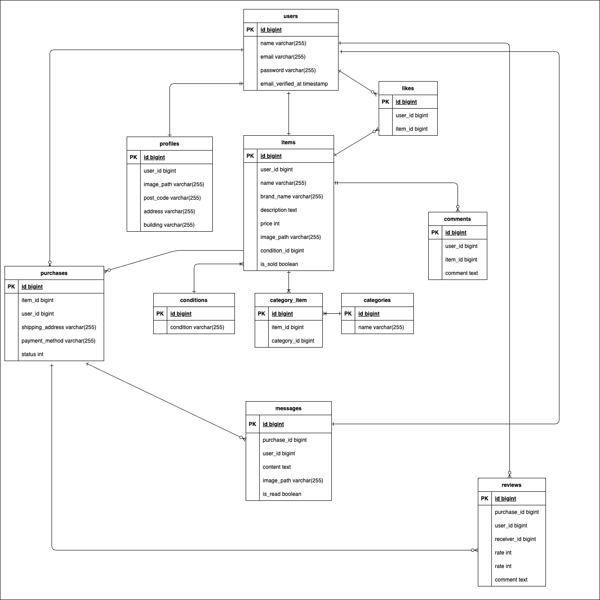

# Coachtech Freemarket

Coachtechフリマアプリのドキュメントです。
基本機能に加え、ユーザー間のやり取りを円滑にするためのメッセージ機能や評価機能を搭載しています。

## 機能概要

ユーザー間で商品の出品・購入ができるフリマアプリケーションです。

### 基本機能
- **会員登録・ログイン**: メール認証機能付き（Laravel Fortify使用）
- **マイページ**: プロフィール編集、出品履歴・購入履歴の確認
- **商品出品**: 画像アップロード、カテゴリ設定、状態設定
- **商品購入**: Stripe決済、配送先住所変更、コンビニ払い（シミュレーション）
- **商品検索・一覧**: お気に入り（マイリスト）機能、タブ切り替え
- **コメント機能**: 商品に対するパブリックな質問機能

### 追加機能 (Advanced)
今回新たに追加実装された機能です。

#### 1. 取引チャット機能 (Message)
購入後、出品者と購入者だけが閲覧できる非公開チャットルームです。
- **メッセージ送信**: テキストおよび画像（S3/ローカルストレージ対応）の送信が可能。
- **編集・削除**: 送信済みの自分のメッセージを編集または削除できます。
- **未読通知**: マイページの「取引中の商品」およびヘッダー等に未読件数バッジを表示。

#### 2. 相互評価機能 (Review)
取引完了後、お互いを5段階で評価します。
- **評価入力**: 1〜5の星評価とコメントを入力。
- **平均評価表示**: プロフィール画面に、受け取った評価の平均を星と数値で表示。
- **ステータス管理**: 出品者・購入者双方が評価を終えると、取引ステータスが「完了」になります。

#### 3. 取引完了メール通知 (Event/Listener)
取引が完全に終了（双方の評価が完了）したタイミングで、自動的にお知らせメールを送信します。
- **Laravel Event/Listener**: イベント駆動アーキテクチャを採用し、コントローラーからメール送信ロジックを分離。
- **Mailable**: Bladeテンプレートを使用したHTMLメール送信。

---

## 使用技術

- **PHP**: 8.x
- **Framework**: Laravel 8.x
- **Database**: MySQL 8.0
- **Web Server**: Nginx
- **Environment**: Docker / Docker Compose
- **Payment**: Stripe API
- **Mail**: MailHog (Local Development)

---

## 環境構築

### 1. 初回セットアップ

リポジトリをクローンした後、以下のコマンドを順に実行してください。

```bash
# Dockerコンテナのビルドと起動
docker-compose up -d --build

# 環境設定ファイルの作成
cp src/.env.example src/.env

# PHPパッケージのインストール
docker-compose exec php composer install

# アプリケーションキーの生成
docker-compose exec php php artisan key:generate

# データベースの初期化（マイグレーション & シーディング）
docker-compose exec php php artisan migrate:fresh --seed
```

### 2. コンテナ操作

```bash
docker-compose up -d    # コンテナ起動
docker-compose down     # コンテナ停止
```

### 3. URL
- **アプリケーション**: http://localhost
- **MailHog (メール確認)**: http://localhost:8025/
- **phpMyAdmin (DB確認)**: http://localhost:8080/

---

## データベース設計 (Database Schema)




各テーブルのカラム詳細は以下の通りです。

### Users
ユーザー認証情報を管理します。
- `id`: ユーザーID (PK)
- `name`: ユーザー名
- `email`: メールアドレス (Unique)
- `email_verified_at`: メール認証日時
- `password`: パスワード (Hash)
- `remember_token`: ログイン保持トークン
- `created_at`: 作成日時
- `updated_at`: 更新日時

### Profiles
ユーザーの詳細プロフィール情報および配送先住所を管理します。
- `id`: プロフィールID (PK)
- `user_id`: ユーザーID (FK -> users)
- `image_path`: プロフィール画像パス
- `post_code`: 郵便番号
- `address`: 住所
- `building`: 建物名
- `created_at`: 作成日時
- `updated_at`: 更新日時

### Items
出品された商品情報を管理します。
- `id`: 商品ID (PK)
- `user_id`: 出品者ID (FK -> users)
- `name`: 商品名
- `brand_name`: ブランド名
- `description`: 商品説明
- `price`: 価格
- `image_path`: 商品画像パス
- `condition_id`: 商品状態ID (FK -> conditions)
- `is_sold`: 売却済みフラグ (true/false)
- `created_at`: 作成日時
- `updated_at`: 更新日時

### Categories
商品カテゴリーのマスタデータです。
- `id`: カテゴリーID (PK)
- `name`: カテゴリー名
- `created_at`: 作成日時
- `updated_at`: 更新日時

### Conditions
商品の状態を表すマスタデータです。
- `id`: 状態ID (PK)
- `condition`: 状態名 (例: 良好)
- `created_at`: 作成日時
- `updated_at`: 更新日時

### Category_item (Pivot)
商品とカテゴリーの多対多リレーションを管理する中間テーブルです。
- `id`: ID (PK)
- `item_id`: 商品ID (FK -> items)
- `category_id`: カテゴリーID (FK -> categories)
- `created_at`: 作成日時
- `updated_at`: 更新日時

### Purchases
商品の購入取引情報を管理します。
- `id`: 取引ID (PK)
- `item_id`: 商品ID (FK -> items, Unique)
- `user_id`: 購入者ID (FK -> users)
- `shipping_post_code`: 配送先郵便番号 (取引時固定)
- `shipping_address`: 配送先住所 (取引時固定)
- `shipping_building`: 配送先建物名
- `payment_method`: 支払い方法
- `status`: 取引状態 (0: 進行中, 1: 評価待ち, 2: 完了)
- `created_at`: 作成日時
- `updated_at`: 更新日時

### Likes
商品への「いいね」情報を管理します。
- `id`: ID (PK)
- `user_id`: ユーザーID (FK -> users)
- `item_id`: 商品ID (FK -> items)
- `created_at`: 作成日時
- `updated_at`: 更新日時

### Comments
商品へのコメント情報を管理します。
- `id`: コメントID (PK)
- `user_id`: 投稿者ID (FK -> users)
- `item_id`: 商品ID (FK -> items)
- `comment`: コメント内容
- `created_at`: 作成日時
- `updated_at`: 更新日時

### Messages
取引画面でのダイレクトメッセージを管理します。
- `id`: メッセージID (PK)
- `purchase_id`: 取引ID (FK -> purchases)
- `user_id`: 送信者ID (FK -> users)
- `content`: メッセージ内容
- `image_path`: 画像パス (任意)
- `is_read`: 既読フラグ (Default: false)
- `created_at`: 作成日時
- `updated_at`: 更新日時

### Reviews
取引完了後の相互評価情報を管理します。
- `id`: レビューID (PK)
- `purchase_id`: 取引ID (FK -> purchases)
- `user_id`: 評価した人 (FK -> users)
- `receiver_id`: 評価された人 (FK -> users, receiver_id)
- `rate`: 評価値 (1-5)
- `comment`: 評価コメント
- `created_at`: 作成日時
- `updated_at`: 更新日時

---

## テストアカウント (Dummy Data)

要件定義に基づき、以下の3名のダミーユーザーを作成しています。

| ユーザー名 | Email | Password | 役割・データ |
|:---|:---|:---|:---|
| **テストユーザーA** | `user1@example.com` | `password` | **CO01〜CO05** の商品を出品中。<br>(腕時計, HDD, 玉ねぎ3束, 革靴, ノートPC) |
| **テストユーザーB** | `user2@example.com` | `password` | **CO06〜CO10** の商品を出品中。<br>(マイク, バッグ, タンブラー, コーヒーミル, メイクセット) |
| **テストユーザーC** | `user3@example.com` | `password` | **初期状態**。<br>出品も購入も履歴がない真っさらな状態。 |

※ `hogehoge@hoge.com` からメールが届くよう設定されています（`.env`）。
